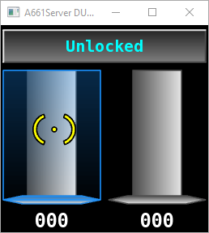

# Integration test for UAs
## Overview
The project `Two` allows testing manually the Generic Integration wrapper and the following generation services:

* WUX2_CTX
* WUX2_UAA

## Setup
* Register the package to SCADE:

  ```cmd
  <python310.exe> -m pip install --user --editable .
  ```

  You can reuse any `<SCADE Installation dir>\SCADE\contrib\Python310\python.exe` or Python 3.10 installation on your computer.

* If you are using SCADE 2024 R2 or below, register the package to SCADE:

  ```cmd
  <python310.exe> -m ansys.scade.wux.register
  ```

* Edit `start_server.bat` and update the path to `A661Server.exe` according to the release of SCADE you are using.
* Open `DF/TwoDF.etp` with SCADE UA Page Creator and launch the command `Project/Generator/Generate`.

## Test
* Execute `start_server.bat` to start the A661 server and verify it starts successfully and displays the following page:

  
* Open `UA/Two.etp` with SCADE Suite.
* Select the configuration `A661` for SCADE 2025 R1 or greater, otherwise the configuration `A661 24R2`.
* Launch the command `Project/Code Generator/Rebuild All Node Two` and verify the build is successful.
* Launch the command `Project/Code Generator/Run Node Two` and verify the server window logs established connection for UA 12.
* Verify the page displays `Locked` instead of `Unlocked` and both sliders are synchronized after moving one of them.
* Launch the command `Project/Code Generator/Stop` and verify the server windows logs a lost connection, and the sliders are no more synchronized.
* Close the window and verify the A661 server is ended.

## Cleaning
You may uninstall the package once the tests are completed:

```cmd
<python3.10.exe> -m pip uninstall ansys-scade-wux
```

If you are using SCADE 2024 R2 or below, remove the SCADE registration:

```cmd
del %APPDATA%\SCADE\Customize\wux24r2.srg
```
